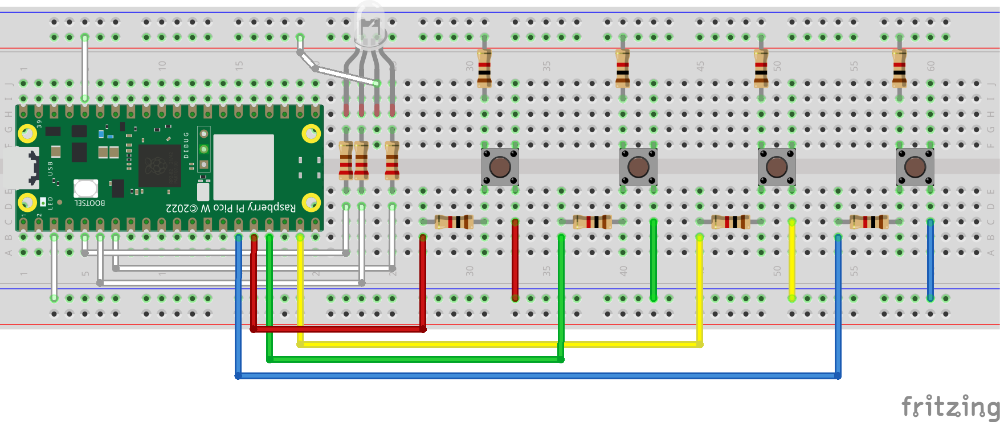

# Simon Game for Raspberry Pi

This is a Python-based implementation of the classic Simon game, designed specifically for Raspberry Pi. Test your memory by repeating the sequence of colors displayed on an RGB LED and controlled via physical buttons.

## Features

- Interactive memory-based gameplay.
- Uses GPIO pins to interface with an RGB LED and buttons.
- Adjustable LED brightness for a smooth visual experience.

## Hardware Requirements

- **Raspberry Pi** (any model with GPIO support).
- **Common Anode RGB LED** (important: ensure you use a common anode RGB LED for compatibility with the PWM control in the script).
- 4 Push Buttons (for red, green, yellow, and blue inputs).
- Resistors (appropriate for LED and button circuits).
- Breadboard and jumper wires.

### GPIO Pin Configuration

| Component     | GPIO Pin      |
|---------------|---------------|
| Red LED       | GPIO 5        |
| Green LED     | GPIO 4        |
| Blue LED      | GPIO 3        |
| Red Button    | GPIO 12       |
| Green Button  | GPIO 13       |
| Yellow Button | GPIO 14       |
| Blue Button   | GPIO 11       |

## Software Requirements

- Python 3
- Raspberry Pi OS (or any Linux-based OS compatible with Raspberry Pi).
- Libraries: `machine`, `utime`

## Circuit Diagram

## How to Play

1. The game starts by displaying a random sequence of colors on the RGB LED.
2. Players must replicate the sequence by pressing the corresponding buttons.
3. Each correct input extends the sequence, making it progressively harder.
4. If the player makes a mistake, the game ends, and the score is displayed.
